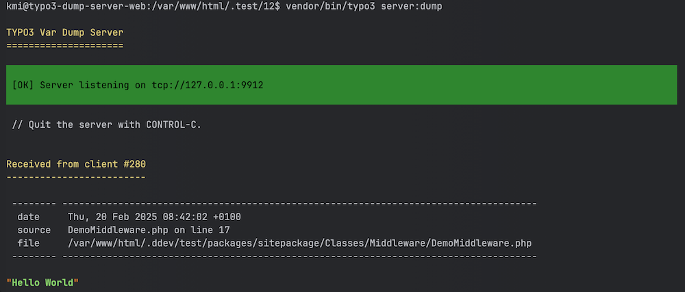
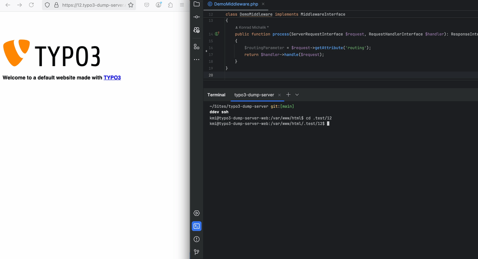

<div align="center">


# TYPO3 extension `typo3_dump_server`

[](https://extensions.typo3.org/extension/typo3_dump_server)
[](https://extensions.typo3.org/extension/typo3_dump_server)
[](LICENSE.md)

</div>

This extension brings the [Symfony Var Dump Server](https://symfony.com/doc/current/components/var_dumper.html#the-dump-server) to TYPO3.

This package provides a dump server that gathers all `dump` call outputs, preventing interference with HTTP or API responses.




## Requirements

* TYPO3 >= 11.5 & PHP 8.1+

## Installation

### Composer

[](https://packagist.org/packages/konradmichalik/typo3-dump-server)
[](https://packagist.org/packages/konradmichalik/typo3-dump-server)

```bash
composer require --dev konradmichalik/typo3-dump-server
```

### TER

[](https://extensions.typo3.org/extension/typo3_dump_server)
[](https://extensions.typo3.org/extension/typo3_dump_server)

Download the zip file from [TYPO3 extension repository (TER)](https://extensions.typo3.org/extension/typo3_dump_server).

## Usage



### Console command

Start the dump server with the following command:

```bash
vendor/bin/typo3 server:dump
```


Use the format option to change the output format to `html`:

```bash
vendor/bin/typo3 server:dump --format=html > dump.html
```

> [!NOTE]  
> The dump server will be available at `tcp://127.0.0.1:9912` by default. Use the environment variable `TYPO3_DUMP_SERVER_HOST` to change the host.

### Dump

Use the `dump` function in your code:

```php
dump($variable);
```

### ViewHelper

Use the `symfony:dump` ViewHelper in your Fluid templates:

```html
<html xmlns:symfony="http://typo3.org/ns/KonradMichalik/Typo3DumpServer/ViewHelpers">

<symfony:dump>{variable}</symfony:dump>
```

### Extension settings

By default, a `dump()` call will add something like the following output to the frontend if the dump server isn't running:


You can suppress this output with the `suppressDump` setting in the extension configuration. If this setting is enabled, the output will be suppressed and the dump will only be sent to the dump server.

You can find the extension settings in the TYPO3 backend under `Admin Tools > Settings > Extension Configuration > typo3_dump_server`.

## Development

Use the following ddev command to easily install all supported TYPO3 versions for locale development.

```bash
$ ddev install all
```

## Credits

This project is highly inspired by the [laravel-dump-server](https://github.com/beyondcode/laravel-dump-server) & the symfony [var-dumper](https://github.com/symfony/var-dumper) component itself.

## License

This project is licensed
under [GNU General Public License 2.0 (or later)](LICENSE.md).
