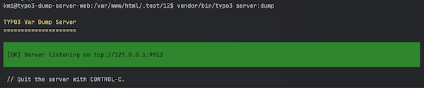

<div align="center">


# TYPO3 extension `typo3_dump_server`

</div>

[](LICENSE.md)

This extension brings the [Symfony Var Dump Server](https://symfony.com/doc/current/components/var_dumper.html#the-dump-server) to TYPO3.

This package provides a dump server that gathers all `dump` call outputs, preventing interference with HTTP or API responses.


## Requirements

* TYPO3 >= 11.5 & PHP 8.1+

## Installation

### Composer

```bash
composer require --dev konradmichalik/typo3-dump-server
```

### TER

Download the zip file from [TYPO3 extension repository (TER)](https://extensions.typo3.org/extension/typo3_dump_server).

## Usage


### Console command

Start the dump server with the following command:

```bash
vendor/bin/typo3 server:dump
```



Use the format option to change the output format to `html`:

```bash
vendor/bin/typo3 server:dump --format=html > dump.html
```

> [!NOTE]  
> The dump server will be available at `tcp://127.0.0.1:9912` by default. Use the environment variable `TYPO3_DUMP_SERVER_HOST` to change the host.

### Dump

Use the `dump` function in your code:

```php
dump($variable);
```

### ViewHelper

Use the `symfony:dump` ViewHelper in your Fluid templates:

```html
<html xmlns:symfony="http://typo3.org/ns/KonradMichalik/Typo3DumpServer/ViewHelpers">

<symfony:dump>{variable}</symfony:dump>
```

## Development

Use the following ddev command to easily install all supported TYPO3 versions for locale development.

```bash
$ ddev install all
```

## Credits

This project is highly inspired by the [laravel-dump-server](https://github.com/beyondcode/laravel-dump-server) & the symfony [var-dumper](https://github.com/symfony/var-dumper) component itself.

## License

This project is licensed
under [GNU General Public License 2.0 (or later)](LICENSE.md).
